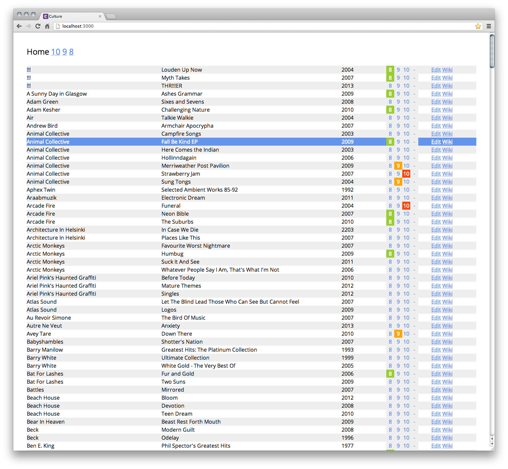

Rails iTunes Albums rating app
===============================

Simple app for rating your iTunes albums.

## How to

* Open iTunes in 'Songs' layout and only display the Name, Album, Artist, and Year columns (in that order)

* Select everything and copy to your clipboard (Ctrl + C or Cmd + C)
* Open your text editor and create a new document
* Make sure your indent settings are set to **Tab** (and not Spaces)

* Save the files as 'itunes.txt' and place it at your app root
* Setup your 'Albums' database using the provided schema
* Run rake import:itunes. It will use your 'itunes.txt' to import your albums, by avoiding duplicates.
* Run your server. You'll be able to rate your albums from 8 to 10. Feel free to add more options.

## Sorting

For albums rated 8 to 10, you can sort them by accessing /list/10 for example. It uses the 'sortable' feature of the jQuery UI library.

## To-Do

* Working on a way to export your favorite albums in a clean HTML format. Example: [http://jthom.as/culture/albums](http://jthom.as/culture/albums)